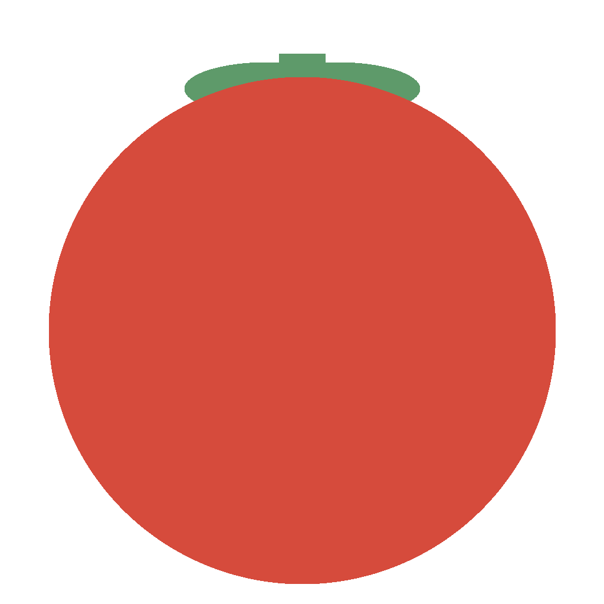
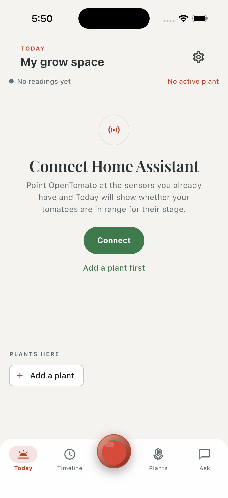
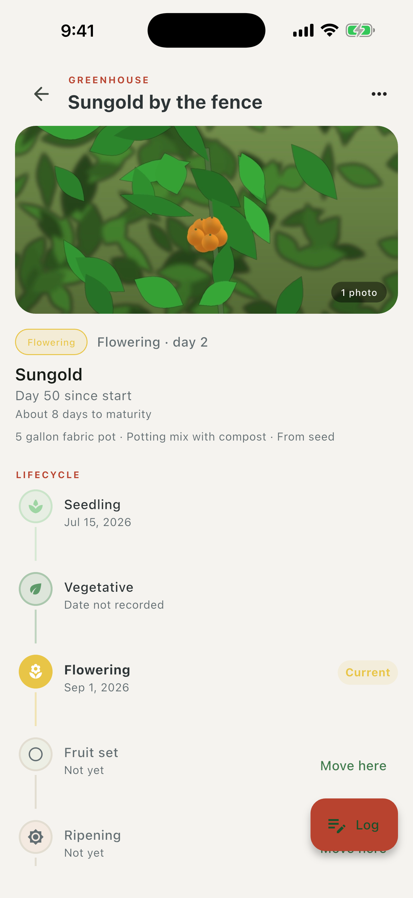
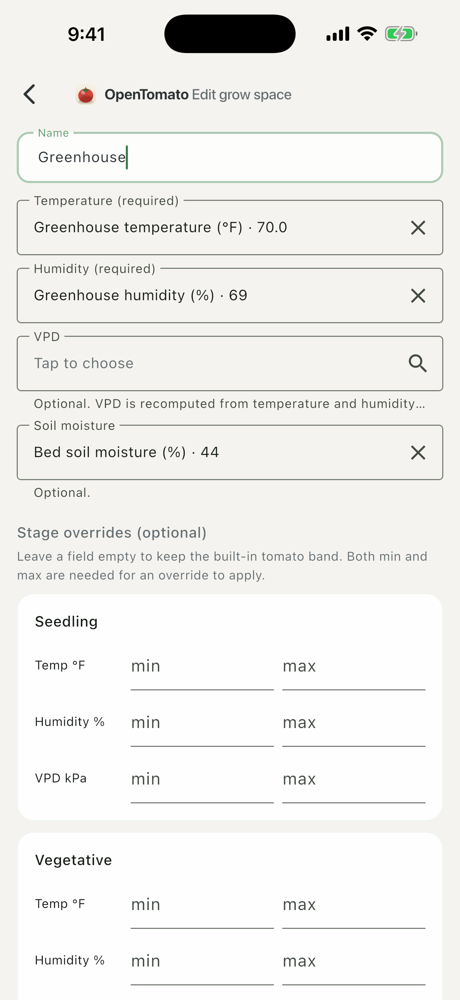

<p align="center">
  
</p>

<h1 align="center">OpenTomato</h1>

<p align="center">
  A tomato-growing assistant that turns the sensors you already have in Home Assistant into plain, stage-aware guidance.
</p>

<p align="center">
  <a href="https://github.com/michaelgriffithus/openTomato/actions/workflows/ci.yml"></a>
  
  
  
</p>

<p align="center">
  
  
  
</p>

## What it does

- **Reads your sensors from Home Assistant.** Temperature, humidity, and optionally VPD and soil moisture, per grow space, over the REST and WebSocket APIs. No add-on, no cloud, no account.
- **Knows what stage your tomatoes are in.** Seedling, vegetative, flowering, fruit set, ripening, harvesting. Each stage has a published temperature, humidity, and VPD window; you can override any of them.
- **Tells you whether you are in range.** One glance: in range, near the boundary, or out. Time-in-range for the last 24 hours and 7 days, and a trace of the day.
- **Keeps a small journal.** Plants and varieties, entries with photos, watering and feeding, and tasks that turn into journal entries when you finish them.
- **Optional assistant with your own key.** Paste an Anthropic or OpenAI key and ask questions about your garden. The app sends a short, visible context block built from your own data. Nothing else leaves the device.

## What it deliberately does not do

No ratings, no scores, no predictions, no diagnosis, no accounts, no telemetry.
Tomatoes have well-published environmental windows for each stage; most home
growers already have a cheap sensor in Home Assistant; OpenTomato is the small,
honest layer between the two.

## Quick start

```sh
git clone https://github.com/michaelgriffithus/openTomato.git
cd openTomato
fvm install
fvm flutter pub get
fvm dart run build_runner build --delete-conflicting-outputs
fvm flutter run
```

Requires [FVM](https://fvm.app) (the pinned Flutter version is in `.fvmrc`). Plain
`flutter` works too if your global version matches.

## Home Assistant setup

1. In Home Assistant, create a long-lived access token from your profile page.
2. In OpenTomato, open **Settings → Home Assistant**, enter your base URL (for
   example `http://homeassistant.local:8123`) and the token, and test the connection.
3. Open **Settings → Grow spaces** and map a temperature and humidity entity.

Your phone is the recorder: readings are stored while the app is open, and each
time you come back the app fills the gap from Home Assistant's history (up to 72
hours). Details in [docs/home_assistant_setup.md](docs/home_assistant_setup.md).

## Stage targets

Built-in defaults; every ideal band can be overridden per grow space.

| Stage | Temp °F | RH % | VPD kPa |
|---|---|---|---|
| Seedling | 70–80 | 60–75 | 0.4–0.8 |
| Vegetative | 70–82 | 55–70 | 0.8–1.2 |
| Flowering | 68–80 | 55–70 | 0.8–1.2 |
| Fruit set | 65–80 | 50–65 | 0.9–1.3 |
| Ripening | 65–78 | 50–65 | 0.9–1.3 |
| Harvesting | 60–78 | 45–65 | 0.9–1.4 |

Sources and safety limits are in [docs/stage_targets.md](docs/stage_targets.md).

## Architecture

```
Home Assistant ──live / poll / 72h backfill──▶ HaEnvironmentSyncService
                                                      │  sanitise, recompute VPD
                                                      ▼
                                             environment_snapshots (Drift)
                                                      ▼
                       StageTargetResolver ▶ RangeEvaluator ▶ TimeInRange ▶ FocusLine
                                                      ▼
                                                TodayContract ▶ Today screen
```

Feature-first Flutter, Riverpod for state, Drift for storage, go_router for
navigation. Screens render from immutable contracts so they can be tested without
a provider scope. More in [docs/architecture.md](docs/architecture.md).

## Roadmap

- Photo attachments for the assistant (separate consent).
- Automatic Home Assistant discovery on the local network.
- Stage playbook: a short "what to watch for" per stage.

## Contributing

Read [CONVENTIONS.md](CONVENTIONS.md) first. Run `tool/leak_scan.sh` and
`tool/size_caps.sh` before opening a pull request; CI runs both.

## License

MIT. See [LICENSE](LICENSE).
